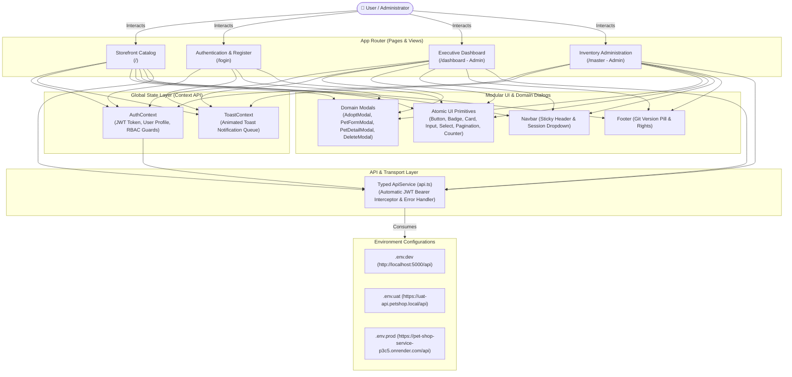

# 🐾 Pet Store — Frontend Web Application

A modern, responsive, and boutique web application built with **Next.js 16 (App Router)**, **React 19**, **TypeScript**, and **Tailwind CSS v4** for the Pet Shop Management System.

[](https://ho-pet-shop-web.vercel.app/)
[](https://nextjs.org/)
[](https://react.dev/)
[](https://www.typescriptlang.org/)
[](https://tailwindcss.com/)
[](https://bun.sh/)

---

## 🏛️ Frontend Architecture & Design Philosophy

The application follows the **Next.js App Router Architecture** with strict **Atomic Component Design**, **Container/Presentational Separation**, and **Centralized Type-Safe API Client**.

### Application Component & Data Flow



---

## 📋 Assignment Requirements Verification Matrix

| Requirement | Implementation Detail | Status |
|---|---|:---:|
| **1. Modern Framework Choice** | Built with **Next.js 16 (App Router) + React 19 + TypeScript**. | ✅ **100% Compliant** |
| **2. Separate `.env` Files** | 3 dedicated, isolated environment files: [`.env.dev`](file:///f:/Interview/pet-shop-web/.env.dev), [`.env.uat`](file:///f:/Interview/pet-shop-web/.env.uat), and [`.env.prod`](file:///f:/Interview/pet-shop-web/.env.prod). | ✅ **100% Compliant** |
| **3. Page 1: Login** | [`/login`](file:///f:/Interview/pet-shop-web/src/app/login/page.tsx): Unified card for Sign In & Registration with full validation and auto-redirect. | ✅ **100% Compliant** |
| **4. Page 2: Dashboard** | [`/dashboard`](file:///f:/Interview/pet-shop-web/src/app/dashboard/page.tsx): Executive KPIs, Recharts bar & donut visualizations, and recent transactions. | ✅ **100% Compliant** |
| **Bonus Pages** | • [`/`](file:///f:/Interview/pet-shop-web/src/app/page.tsx): Storefront Catalog with dynamic pagination (`20, 40, 60, 80, 100`) and one-click adoption.<br>• [`/master`](file:///f:/Interview/pet-shop-web/src/app/master/page.tsx): Backoffice Inventory CRUD with Table/Grid toggles. | 🌟 **Extra Enterprise Value** |
| **Integration & Cloud Ready** | Fully connected to Live Render Backend API. Deployed and verified on Vercel. | ✅ **100% Compliant** |

---

## 🌐 Multi-Environment Configuration (DEV / UAT / PROD)

The application provides out-of-the-box support for 3 independent deployment stages:

| Environment | File | Backend API Base URL | Debug Mode | Run Command | Build Command |
|---|---|---|:---:|---|---|
| **Development** | `.env.dev` | `http://localhost:5000/api` | `true` | `bun run dev` | `bun run build:dev` |
| **UAT (Staging)** | `.env.uat` | `https://uat-api.petshop.local/api` | `true` | `bun run dev:uat` | `bun run build:uat` |
| **Production** | `.env.prod` | `https://pet-shop-service-p3c5.onrender.com/api` | `false` | `bun run dev:prod` | `bun run build` *(or `bun run build:prod`)* |

### 🏷️ Dynamic Git-Tied Version Pill
The application automatically resolves its version in the Footer:
- In production, it checks `git describe --tags` (e.g. `v1.0.0`).
- If running in DEV or UAT, it cleanly appends the environment suffix (`v1.0.0-dev` or `v1.0.0-uat`).

---

## 📱 Pages & Features Overview

### 1. Storefront Catalog (`/`)
- **Hero Carousel**: Auto-advancing promotional banners highlighting pet stories and adoption campaigns.
- **Species Filters**: Category chips (Dogs, Cats, Birds, Aquarium, Small Pets, Reptiles) with live counter counts.
- **Real-Time Search**: Instant keyword filtering across breed, name, and background temperament.
- **Dynamic Pagination**: User-selectable page size options (**`20, 40, 60, 80, 100`** pets per page).
- **One-Click Adoption Modal**: Full adoption form with adopter name, contact phone, and payment method selection.
- **Clean Image Handling**: Displays high-resolution photos with fallback to an elegant "No Image" placeholder box.

### 2. Authentication & Registration (`/login`)
- **Dual Tab Architecture**: Effortlessly switch between **Sign In** and **Create Account**.
- **Role-Aware Redirection**: Administrators are redirected to `/dashboard`; standard users to `/`.
- **Validation**: Full client-side validation for username, password, phone, and email formatting.

### 3. Executive Dashboard (`/dashboard` — Admin Only)
- **RBAC Protected**: Guarded by both client and server token verification.
- **Real-Time KPIs**: Animated counters for Total Inventory, Available Pets, Total Adoptions, and Total Revenue.
- **Interactive Recharts**:
  - Category Distribution (Bar Chart with hover tooltips).
  - Inventory Status Ratio (Donut / Pie Chart).
- **Recent Activity**: Live transaction feed of recent pet listings and adoption orders.

### 4. Inventory Administration (`/master` — Admin Only)
- **Table / Grid View Toggle**: Switch between compact data density table and visual card grid.
- **Full CRUD Management**: Add new pets, edit profiles, toggle adoption status in 1 click, and delete records.
- **Category Creation**: Add new pet species categories on the fly.
- **Zero Stale Values**: Form automatically resets to blank fields when adding new pets.

---

## 📁 Component Directory Architecture

```text
src/
├── app/                  # Next.js App Router
│   ├── page.tsx          # Storefront Catalog & Carousel
│   ├── login/page.tsx    # Sign In & Registration (Page 1)
│   ├── dashboard/page.tsx# Executive Analytics & Charts (Page 2)
│   ├── master/page.tsx   # Inventory Management CRUD
│   ├── layout.tsx        # Global Layout, Fonts & Context Providers
│   └── globals.css       # Tailwind CSS v4 Theme Tokens
│
├── components/           # Component Library
│   ├── Navbar.tsx        # Sticky Header with Role Dropdown
│   ├── Footer.tsx        # Global Footer with Git Version Pill
│   │
│   ├── modals/           # ✨ Domain Modal Dialogs (Clean Barrel Export)
│   │   ├── AdoptModal.tsx       # Adoption Checkout & Payment Modal
│   │   ├── DeleteModal.tsx      # Record Deletion Confirmation Modal
│   │   ├── LoginPromptModal.tsx # Guest Sign-in Prompt Modal
│   │   ├── PetDetailModal.tsx   # Comprehensive Pet Profile Modal
│   │   ├── PetFormModal.tsx     # Pet Create & Edit Modal
│   │   └── index.ts             # Barrel Export
│   │
│   └── ui/               # Reusable Atomic UI Primitives
│       ├── Button.tsx    # Button with primary, secondary, outline, and loading states
│       ├── Badge.tsx     # Status Badges (Available, Adopted, Pending)
│       ├── Card.tsx      # Elevated Glassmorphic Card Container
│       ├── Counter.tsx   # Animated Number Counting Component
│       ├── Input.tsx     # Input field with label and error validation
│       ├── Modal.tsx     # Backdrop blur dialog primitive
│       ├── Pagination.tsx# Responsive pagination with page-size selector
│       └── Select.tsx    # Accessible dropdown selector
│
├── context/              # Global State Providers
│   ├── AuthContext.tsx   # JWT Token Storage, User Roles, and Protected Route Guards
│   └── ToastContext.tsx  # Global Animated Toast Notification System
│
├── services/             # HTTP Client Layer
│   └── api.ts            # Typed HTTP Client with Automatic JWT Interceptor
│
└── types/                # System Type Definitions
    └── index.ts          # Models, DTOs, and API Contracts
```

---

## 🚀 Getting Started (Run Locally)

### Prerequisites
- [Bun](https://bun.sh) (recommended) or [Node.js 18+](https://nodejs.org/)
- Git

### Installation & Run

1. Clone the repository and navigate into the folder:
   ```bash
   git clone https://github.com/Ho-Sittichai/pet-shop-web.git
   cd pet-shop-web
   ```

2. Install dependencies:
   ```bash
   bun install
   # Or if using npm:
   # npm install
   ```

3. Run in your desired environment:

   ```bash
   # Development (Connects to localhost:5000 by default):
   bun run dev
   # Or with npm: npm run dev

   # UAT Environment:
   bun run dev:uat

   # Production (Connects directly to Live Render Cloud Backend):
   bun run dev:prod
   ```

4. Open [http://localhost:9999](http://localhost:9999) in your browser.

---

### Production Build & Run

To test the optimized, minified production build locally:

```bash
# 1. Build optimized bundle using .env.prod:
bun run build

# 2. Start production server:
bun run start
```

---

## 🔑 Pre-Configured Accounts for Testing

| Role | Username | Password | Access Capabilities |
|---|---|---|---|
| **Administrator** | `admin` | `admin123` | Dashboard Analytics, Inventory Management, Add/Edit/Delete Pets |
| **Standard User** | `user` | `user123` | Browse Catalog, Submit Adoption Orders, View Profile |

*(You can also use the **Click to register** link on the login page to create a brand new account anytime!)*

---

## ☁️ Live Cloud Deployment (Vercel)

The application is deployed on **Vercel**:
- **Live URL**: [https://ho-pet-shop-web.vercel.app/](https://ho-pet-shop-web.vercel.app/)
- **Backend Connected**: [https://pet-shop-service-p3c5.onrender.com/api](https://pet-shop-service-p3c5.onrender.com/api)
- **Deployment Strategy**: Automated Continuous Deployment (CD) triggered by git push to `main`.
